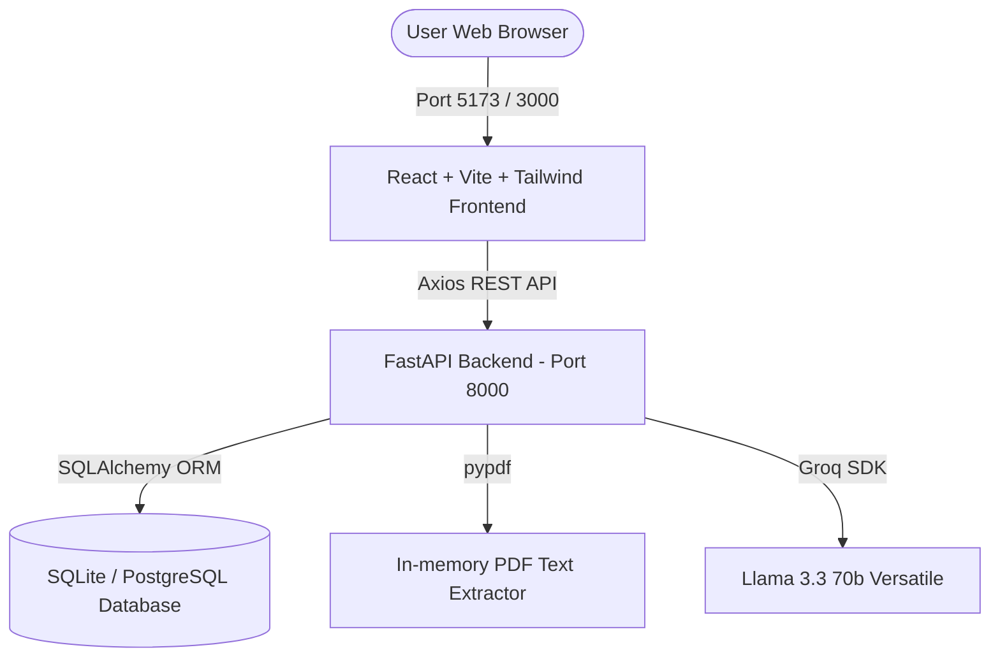

# AI Resume Analyzer & ATS Optimizer 🧠🚀

A premium, full-stack web application designed to parse, score, and optimize resumes for ATS (Applicant Tracking Systems) and match them against target job descriptions. 

Powered by **Groq API (Llama 3.3 70b)** for high-speed, detailed critiques, **pypdf** for pure-Python parsing, **FastAPI (Python)**, and **React (Vite + TypeScript + Tailwind CSS)**.

---

## 🛠️ Architecture & Core Features



### Key Capabilities:
* **Anonymous Resume Upload**: Instantly upload PDF resumes and receive circular color-coded ATS score cards (Red/Orange/Yellow/Green) along with core strengths, vulnerabilities, and actionable suggestions.
* **Target Job Description Matching**: Paste a target Job Description to generate a secondary JD Match Score and see a dedicated tags deck showing exactly which required skills are missing from your resume.
* **Persistent Search History (Authenticated)**: Create an account and log in to automatically save analysis reports. View previous analyses in a timeline grid, where you can **expand any item in-place** to reload its entire visual dashboard.
* **Developer Sandbox Fallback**: If run without an active Groq API key, a local heuristic scanner automatically analyzes the resume text using key matching to calculate a realistic score and keywords, letting you test the entire app immediately.

---

## 💻 Technology Stack

* **Frontend**: React 18, TypeScript, Vite, Tailwind CSS, Zustand (state management), React Router DOM, Lucide Icons, Axios.
* **Backend**: FastAPI (Python), Uvicorn, Pydantic Settings, SQLAlchemy ORM, python-jose (JWT Auth), passlib (bcrypt password hashing), pypdf (pure-Python text extractor), groq (API integration).
* **Database**: SQLite (default zero-config local run) / PostgreSQL (production-ready).
* **Containerization**: Docker & Docker Compose for multi-container bridge networking.
* **CI/CD**: GitHub Actions deploying to GCP Cloud Run.

---

## 🚀 Getting Started

### Option A: Local Dev Servers (Host Machine)

This is the fastest way to run the application using a local SQLite database, especially on Windows hosts.

#### 1. Setup Backend API
1. Navigate to the `backend/` directory:
   ```bash
   cd backend
   ```
2. Create and activate a Python virtual environment:
   ```bash
   python -m venv venv
   # On Windows:
   .\venv\Scripts\activate
   # On macOS/Linux:
   source venv/bin/activate
   ```
3. Install dependencies:
   ```bash
   pip install -r requirements.txt
   ```
4. Copy the environment template and set your Groq API key:
   ```bash
   copy .env.example .env
   ```
   Edit `.env` and set:
   ```ini
   DATABASE_URL=sqlite:///./resumedb.db
   GROQ_API_KEY=gsk_your_real_key_here
   ```
5. Start the FastAPI development server:
   ```bash
   uvicorn app.main:app --reload --host 0.0.0.0 --port 8000
   ```
   * **API Swagger Docs**: Access [http://localhost:8000/docs](http://localhost:8000/docs)

#### 2. Setup Frontend client
1. Open a new terminal and navigate to the `frontend/` directory:
   ```bash
   cd frontend
   ```
2. Install npm packages:
   ```bash
   npm install
   ```
3. Copy the environment template:
   ```bash
   copy .env.example .env
   ```
4. Run the Vite React development server:
   ```bash
   npm run dev
   ```
5. Open **[http://localhost:5173](http://localhost:5173)** in your default browser.

---

### Option B: Docker Compose (Bridge Network)

This builds both the frontend static Nginx distribution and the backend python containers, connecting them to a PostgreSQL instance in a isolated virtual network.

1. Create a `.env` in the `backend/` directory with your Groq API Key.
2. Spin up all three containers from the root directory:
   ```bash
   docker compose up --build
   ```
3. **Access Services**:
   - **Frontend UI**: [http://localhost:3000](http://localhost:3000)
   - **Backend API Docs**: [http://localhost:8000/docs](http://localhost:8000/docs)

---

## 🔒 Environment Variable Specifications

### Backend `.env` Template
```ini
DATABASE_URL=sqlite:///./resumedb.db  # Use postgresql://... in docker/production
GROQ_API_KEY=gsk_your_groq_token_here
SECRET_KEY=generate_a_random_32_character_hex_string_for_security
ALGORITHM=HS256
ACCESS_TOKEN_EXPIRE_MINUTES=60
```

### Frontend `.env` Template
```ini
VITE_API_URL=http://localhost:8000
```

---

## ✈️ CI/CD Deployment to GCP

A preconfigured GitHub Actions workflow exists under `.github/workflows/deploy.yml`. When you push to the `main` branch, the workflow:
1. Checks out your code.
2. Authenticates with Google Cloud Platform using a secure `GCP_SA_KEY` secret.
3. Builds your backend image using Google Cloud Build and pushes it to GCR.
4. Deploys the image to **GCP Cloud Run** (region `asia-south1`) while injecting necessary secrets dynamically from your GitHub Action secrets.

### Required GitHub Actions Secrets:
* `GCP_SA_KEY` (JSON Service Account credentials)
* `GCP_PROJECT_ID` (Your active GCP Project ID)
* `DATABASE_URL` (Production database connection string)
* `GROQ_API_KEY` (Your Groq API token)
* `SECRET_KEY` (Your JWT signed security token)
